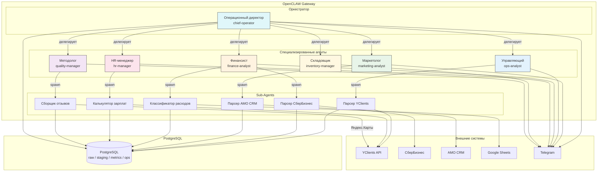
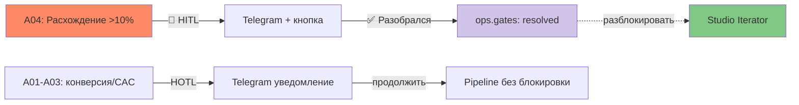
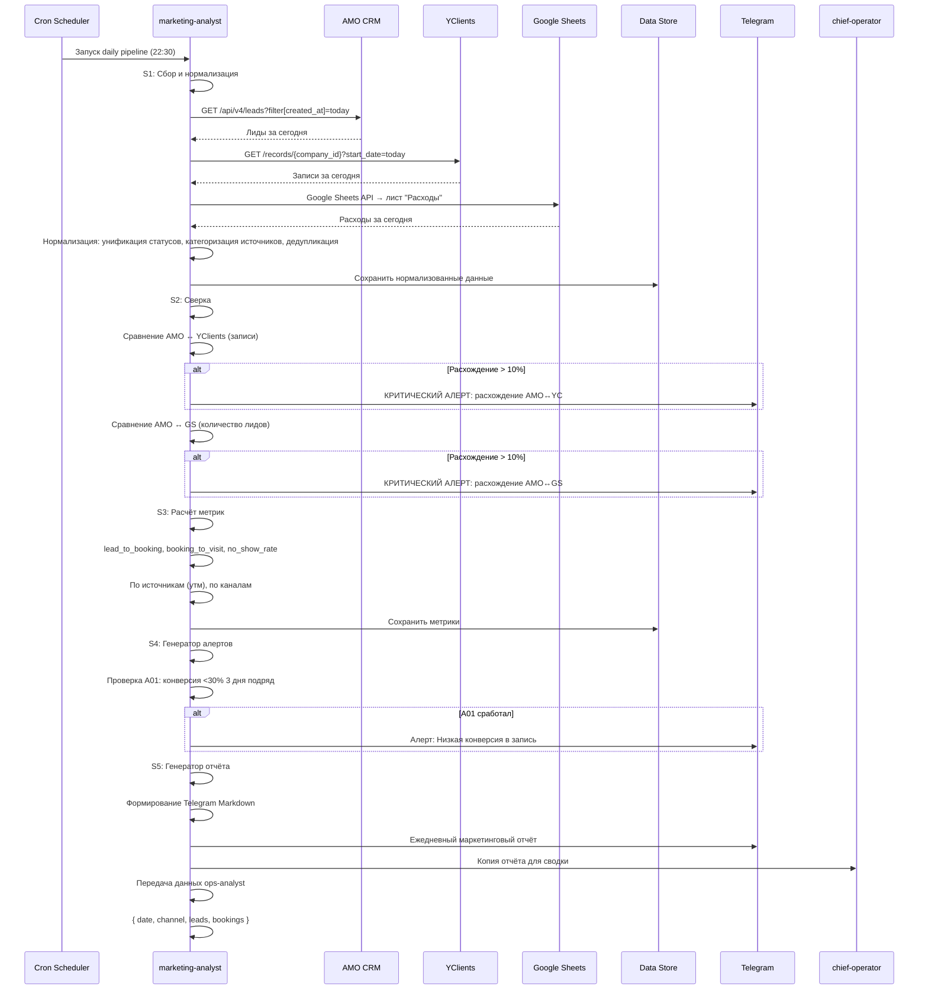
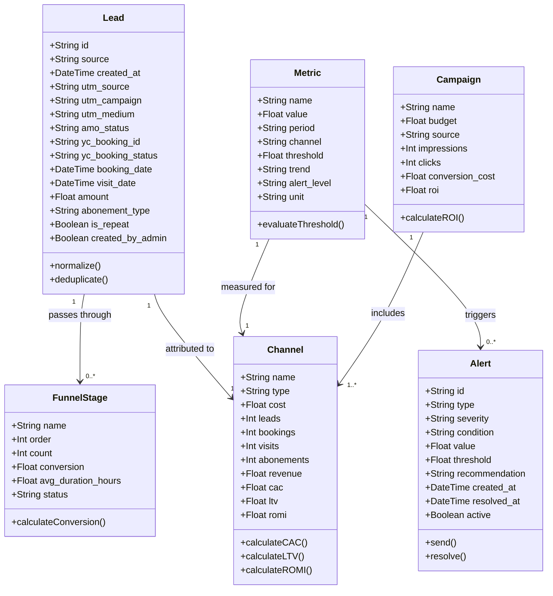
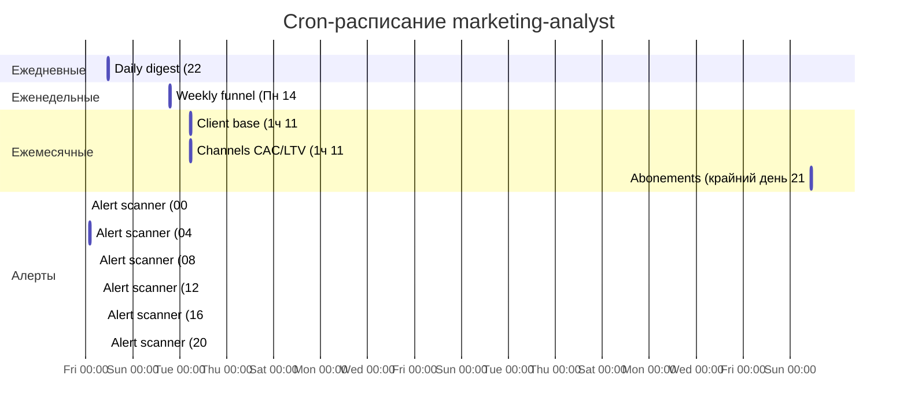

# Архитектура AI-агента marketing-analyst

## 1. Введение

### 1.1 Цель документа

Документировать архитектуру AI-агента `marketing-analyst` на платформе OpenCLAW: его место в системе, внутреннее устройство, потоки данных, cron-расписание, модели данных и интеграции со смежными агентами.

### 1.2 Бизнес-контекст

Сеть массажных студий XSize автоматизирует операционную деятельность с помощью команды AI-агентов. Агент `marketing-analyst` отвечает за маркетинговый анализ: сбор лидов из AMO CRM, записей из YClients, расходов из Google Sheets, расчёт конверсий, CAC, LTV, ROMI, генерацию алертов и регулярных отчётов.

**Ответственные:** Георгий (основной), Анастасия (резервный).

**Периодичность:**
- Ежедневно (оперативные отчёты по лидам, записям и заполненности)
- Еженедельно (воронка за неделю, эффективность каналов, неявки/отмены)
- Ежемесячно (LTV, CAC, клиентская база)
- По запросу (NL-запросы через Telegram)

---

## 2. Общая архитектура системы AI-агентов

Система построена по архитектурному паттерну **Hub-and-Spoke (Agent Team)** на платформе OpenCLAW.



### 2.1 Роли в системе

| Агент | Роль | Конвенция | Внешние системы |
|-------|------|-----------|-----------------|
| **chief-operator** | Оркестратор, координация всех агентов, формирование сводок | operational-management | Telegram |
| **marketing-analyst** | Лиды, воронка, конверсия, CAC, LTV, ROMI | marketing-analysis | AMO CRM, YClients, Google Sheets, Telegram |
| **ops-analyst** | Записи, клиенты, загрузка студии | operational-analysis | YClients, Telegram |
| **finance-analyst** | Выручка, расходы, прибыль, P&L | financial-analysis | СберБизнес, YClients, Telegram |
| **hr-manager** | Вал мастеров, KPI, зарплаты | hr-management | YClients, Telegram |
| **inventory-manager** | Остатки, заказы, закупки | inventory-management | Telegram |
| **quality-manager** | Отзывы, NPS, CSI, оценки мастеров | quality-standards | YClients, Яндекс.Карты, Telegram |

### 2.2 Поток данных

```
AMO CRM ──→ marketing-analyst ──→ Конверсия, лиды ──→ Telegram (Георгий)
YClients ──→ marketing-analyst ──→ Сверка записей ──→ Telegram
Google Sheets ──→ marketing-analyst ──→ Расходы на каналы ──→ Telegram
```

---

## 3. Платформа OpenCLAW

OpenCLAW — платформа для развёртывания и управления AI-агентами. Каждый агент работает в изолированном workspace с собственной идентичностью (SOUL.md), навыками (SKILL.md) и инструментами (TOOLS.md).

### 3.1 Ключевые компоненты платформы

| Компонент | Назначение |
|-----------|------------|
| **Gateway** | Точка входа, управление сессиями и событиями. Multi-Channel Inbox (Telegram, Slack, Web) |
| **Multi-Agent Router** | Маршрутизация сообщений между агентами |
| **Workspace** | Изолированная директория агента: SOUL.md, SKILL.md, TOOLS.md, data, scripts, config |
| **Sandbox** | Docker-контейнер для изолированного выполнения Python-скриптов (python:3.12-slim) |
| **Cron Scheduler** | Планировщик периодических задач |
| **Tools** | HTTP Client, Browser, Bash-exec, Canvas, File-read/File-write |

### 3.2 Принципы работы

1. **Оркестратор (chief-operator)** координирует 6 специализированных агентов
2. Агенты могут запускать **Sub-Agents** (одноразовые скрипты в sandbox) для сбора данных
3. Все результаты сохраняются в **Shared Memory** (база метрик и конвенций)
4. Отчёты доставляются в **Telegram** через Bot API
5. **Cron** запускает pipeline по расписанию

---

## 4. Архитектура marketing-analyst

Агент `marketing-analyst` построен по архитектурному паттерну **Pipeline** (конвейерная обработка данных) с элементами **Event-Driven** (алерты по условиям).

```mermaid
flowchart TB
    %% ========== Styles ==========
    classDef chief fill:#e0f7fa,stroke:#006064,stroke-width:2px
    classDef agent fill:#e8f5e9,stroke:#2e7d32,stroke-width:2px
    classDef parser fill:#a5d6a7,stroke:#1b5e20
    classDef process fill:#81c784,stroke:#1b5e20
    classDef external fill:#e3f2fd,stroke:#1565c0,stroke-width:2px
    classDef telegram fill:#e1f5fe,stroke:#01579b
    classDef storage fill:#ede7f6,stroke:#4527a0
    classDef dataModel fill:#d1c4e9,stroke:#4527a0
    classDef alert fill:#ffcc80,stroke:#e65100
    classDef nlQuery fill:#ffe0b2,stroke:#e65100
    classDef platform fill:#f5f5f5,stroke:#616161
    classDef integration fill:#f3e5f5,stroke:#7b1fa2,stroke-dasharray: 5 5

    %% ========== 1. OpenCLAW PLATFORM ==========
    subgraph PLATFORM["OpenCLAW Platform (Hub-and-Spoke)"]
        direction TB
        CHANNELS["Multi-Channel Inbox<br/>Telegram / Slack / Web"]
        GATEWAY["Gateway<br/>Session & Event Manager"]
        ROUTER["Multi-Agent Router<br/>Message Routing"]
        CHANNELS --> GATEWAY
        GATEWAY --> ROUTER
    end

    %% ========== 2. ORCHESTRATOR ==========
    subgraph ORCH["Orchestration Layer"]
        CHIEF["chief-operator<br/>Операционный директор<br/>Координация агентов<br/>Утренние/вечерние сводки"]
    end

    %% ========== 3. MARKETING AGENT ==========
    subgraph MARKETING["🤖 marketing-analyst"]
        AGENT["marketing-analyst<br/>Маркетолог<br/>Лиды, воронка, конверсия<br/>CAC, LTV, ROMI"]:::agent

    %% ========== 4. MARKETING AGENT WORKSPACE ==========
    subgraph WORKSPACE["Workspace (OpenCLAW)"]
        direction TB

        subgraph IDENTITY["Agent Identity"]
            SOUL["SOUL.md<br/>Личность: Маркетолог массажной студии"]
            SKILL["SKILL.md<br/>Основной промпт: роль, pipeline, формат отчётов"]
            TOOLS["TOOLS.md<br/>Доступные инструменты"]
        end

        subgraph PARSERS["S1: Data Connectors (Python Sub-Agents)"]
            P_AMO["amo_crm_connector<br/>Лиды, Воронка, Этапы, UTM<br/>API: AMO CRM REST"]
            P_YC["yclients_connector<br/>Записи, Визиты, Клиенты, Суммы<br/>API: YClients REST"]
            P_GS["gsheets_connector<br/>Расходы по статьям<br/>Google Sheets API"]
        end

        subgraph CRON["Cron Jobs (Scheduled Tasks)"]
            CRON_DAILY["daily_digest<br/>Ежедневно 22:30<br/>Лиды, конверсии"]
            CRON_WEEKLY["weekly_funnel<br/>Пн 14:00<br/>Воронка, каналы"]
            CRON_MONTHLY1["monthly_retention<br/>1 число 11:00<br/>Клиентская база"]
            CRON_MONTHLY2["monthly_abonements<br/>Крайний день 21:00<br/>Рейтинг абонементов"]
            CRON_MONTHLY3["monthly_channels<br/>1 число 11:05<br/>CAC, LTV, ROI"]
            CRON_ALERT["alert_scanner<br/>Каждые 4 часа<br/>Проверка алертов"]
        end

        subgraph PIPELINE["Data Processing Pipeline"]
            direction TB
            PIPE_NORM["S2: Normalize — Нормализация<br/>Дедупликация, унификация статусов,<br/>категоризация источников<br/>raw.* → staging.*"]
            PIPE_REC["S3: Reconcile — Сверка<br/>AMO ↔ YClients ↔ GS<br/>Расхождения >10% → Critical Alert"]
            PIPE_METRICS["S4: Metrics — Расчёт метрик<br/>Конверсии, CAC, LTV, ROMI<br/>Trends (WoW, MoM)"]
            PIPE_ALERTS["S5a: Alerts — Генератор алертов<br/>A01-A04: конверсия, неявки, CAC, расхождения"]
            PIPE_REPORTS["S5b: Reports — Генератор отчётов<br/>Ежедневные / еженедельные / ежемесячные<br/>Формат: Telegram Markdown"]
        end

        subgraph NL_HANDLER["Natural Language Query Handler"]
            NL_INPUT["Входящий запрос<br/>покажи лиды за вчера / какая конверсия"]
            NL_PARSE["Парсинг намерения<br/>get_leads | get_conversion | get_channels"]
            NL_EXEC["Исполнение запроса<br/>Query metrics DB or trigger pipeline step"]
        end

        subgraph STORE["PostgreSQL — слои данных"]
            subgraph RAW_LAYER["Schema: raw"]
                RAW_AMO["raw.amo_leads<br/>лиды, статусы, UTM"]
                RAW_YC["raw.yc_visits<br/>записи, визиты, суммы"]
                RAW_GS["raw.gs_expenses<br/>расходы по статьям"]
            end
            subgraph STG_LAYER["Schema: staging"]
                STG_LEADS["staging.leads_normalized<br/>единая модель Lead"]
            end
            subgraph MET_LAYER["Schema: metrics"]
                MET_DAILY["metrics.daily_summary<br/>конверсии по дням/каналам"]
                MET_WEEKLY["metrics.weekly_funnel<br/>воронка, тренды WoW"]
                MET_MONTHLY["metrics.monthly_cohorts<br/>CAC, LTV, ROMI"]
                MET_CH["metrics.channel_roi<br/>ROI по каналам"]
            end
            subgraph OPS_LAYER["Schema: ops"]
                OPS_ALERTS["ops.active_alerts<br/>текущие алерты"]
                OPS_CFG["ops.config<br/>пороги, расписания"]
            end
        end

        subgraph TOOLS_SECTION["OpenCLAW Tools"]
            T_HTTP["HTTP Client - AMO & YClients API"]
            T_BROWSER["Browser Tool - Google Sheets access"]
            T_CRON["Cron Scheduler"]
            T_SANDBOX["Docker Sandbox - Python 3.12"]
        end
    end
    end

    %% ========== 5. EXTERNAL SYSTEMS ==========
    subgraph EXTERNAL["External Systems"]
        AMO[AMO CRM - Лиды / Воронка / UTM]
        YC[YClients - Записи / Визиты / Клиенты]
        GS[Google Sheets - Расходы по статьям]
    end

    %% ========== 6. DELIVERY ==========
    subgraph DELIVERY["Delivery Channels"]
        TG[Telegram - Георгий + чаты]
    end

    %% ========== 7. OTHER AGENTS ==========
    subgraph INTEGRATIONS["Integration with Other AI Agents"]
        OPS["ops-analyst - Операционный<br/>Загрузка студии по каналам"]
        FIN["finance-analyst - Финансист<br/>CAC / ROMI / Выручка по каналам"]
        HR["hr-manager - HR-менеджер<br/>Распределение клиентов по мастерам"]
        QUAL["quality-manager - Методолог<br/>Качество трафика по каналам"]
    end

    %% ========== FLOWS ==========
    CHIEF -->|"координирует"| AGENT
    CHIEF -->|"получает сводки"| TG
    AGENT -->|"работает в"| WORKSPACE
    ROUTER -->|"маршрутизирует"| AGENT

    SOUL -.-> SKILL
    SKILL -.-> TOOLS

    %% Cron triggers pipeline
    CRON_DAILY -->|"запуск 22:30"| PIPE_NORM
    CRON_WEEKLY -->|"запуск Пн 14:00"| PIPE_NORM
    CRON_MONTHLY1 -->|"запуск 1ч 11:00"| PIPE_NORM
    CRON_MONTHLY2 -->|"запуск крайний день 21:00"| PIPE_NORM
    CRON_MONTHLY3 -->|"запуск 1ч 11:05"| PIPE_NORM
    CRON_ALERT -->|"каждые 4ч"| PIPE_ALERTS

    %% Parsers fetch from External
    P_AMO <-->|"REST API"| AMO
    P_YC <-->|"REST API"| YC
    P_GS <-->|"Browser/API"| GS

    %% Parsers → PostgreSQL raw
    P_AMO -->|"INSERT"| RAW_AMO
    P_YC -->|"INSERT"| RAW_YC
    P_GS -->|"INSERT"| RAW_GS

    %% Pipeline S2: читает raw → пишет staging
    PIPE_NORM -->|"SELECT"| RAW_AMO
    PIPE_NORM -->|"SELECT"| RAW_YC
    PIPE_NORM -->|"SELECT"| RAW_GS
    PIPE_NORM -->|"INSERT"| STG_LEADS

    %% Pipeline flow
    PIPE_NORM -->|"нормализованные данные"| PIPE_REC
    PIPE_REC -->|"сверенные данные"| PIPE_METRICS
    PIPE_METRICS -->|"метрики"| PIPE_ALERTS
    PIPE_METRICS -->|"метрики"| PIPE_REPORTS

    %% Pipeline → PostgreSQL metrics
    PIPE_METRICS -->|"INSERT"| MET_DAILY
    PIPE_METRICS -->|"INSERT"| MET_WEEKLY
    PIPE_METRICS -->|"INSERT"| MET_MONTHLY
    PIPE_METRICS -->|"INSERT"| MET_CH
    PIPE_ALERTS -->|"INSERT"| OPS_ALERTS
    OPS_CFG -.->|"SELECT пороги"| PIPE_ALERTS

    %% Reports Delivery
    PIPE_REPORTS -->|"отчёты"| TG

    %% Alerts Delivery
    PIPE_ALERTS -->|"важные / критические"| TG

    %% NL Query flow — читает готовые данные из PostgreSQL
    CHIEF -->|"NL запрос от Георгия"| NL_INPUT
    NL_INPUT --> NL_PARSE
    NL_PARSE --> NL_EXEC
    NL_EXEC -->|"SELECT"| MET_DAILY
    NL_EXEC -->|"SELECT"| OPS_ALERTS
    NL_EXEC -->|"ответ"| TG

    %% Cross-agent Integrations
    PIPE_METRICS -->|"Лиды по каналам"| OPS
    PIPE_METRICS -->|"CAC / ROMI / Выручка"| FIN
    PIPE_METRICS -->|"Новые клиенты по мастерам"| HR
    PIPE_METRICS -->|"Качество трафика по каналам"| QUAL

    %% Agent feedback
    OPS -.->|"фактические визиты"| PIPE_REC
    FIN -.->|"реальные расходы"| PIPE_REC
    QUAL -.->|"оценка каналов"| PIPE_METRICS

    %% Apply styles
    class CHIEF chief
    class AGENT,WORKSPACE agent
    class P_AMO,P_YC,P_GS parser
    class PIPE_NORM,PIPE_REC,PIPE_METRICS,PIPE_ALERTS,PIPE_REPORTS process
    class AMO,YC,GS external
    class TG telegram
    class RAW_AMO,RAW_YC,RAW_GS,STG_LEADS,MET_DAILY,MET_WEEKLY,MET_MONTHLY,MET_CH,OPS_ALERTS,OPS_CFG storage
    class CRON_DAILY,CRON_WEEKLY,CRON_MONTHLY1,CRON_MONTHLY2,CRON_MONTHLY3,CRON_ALERT alert
    class NL_INPUT,NL_PARSE,NL_EXEC nlQuery
    class CHANNELS,GATEWAY,ROUTER platform
    class OPS,FIN,HR,QUAL integration
```



### 4.1 Описание компонентов

#### 4.1.1 Agent Identity (SOUL.md / SKILL.md / TOOLS.md)

| Файл | Назначение |
|------|------------|
| **SOUL.md** | Личность агента: "Ты marketing-analyst — AI-агент маркетингового анализа сети массажных студий". Определяет роль, tone of voice, ценности. |
| **SKILL.md** | Основной промпт: полный pipeline обработки данных (6 шагов), формат всех отчётов, обработка NL-запросов, интеграции с другими агентами, обработка ошибок, логирование. |
| **TOOLS.md** | Описание доступных инструментов: HTTP Client, Browser, Bash-exec (sandbox), Canvas, Cron, File-read/File-write. |

#### 4.1.2 Data Connectors (Python Sub-Agents)

Три Python-коннектора, выполняющиеся в изолированном Docker sandbox:

**amo_crm_connector**
- **Источник:** AMO CRM REST API
- **Эндпоинты:** `/api/v4/leads`, `/api/v4/contacts`, `/api/v4/leads/pipelines/{id}`, `/api/v4/events`
- **Данные:** ID лида, дата создания, источник/канал, этап воронки, ответственный менеджер, рекламный креатив/кампания, UTM-метки
- **Аутентификация:** OAuth2
- **Rate limit:** 4 запроса/сек

**yclients_connector**
- **Источник:** YClients REST API
- **Эндпоинты:** `/records/{company_id}`, `/clients/{company_id}`, `/sales/{company_id}`
- **Данные:** Записи, визиты, клиенты, суммы оплат, статусы записей (confirmed/canceled/visited/not_visited)
- **Аутентификация:** Bearer token
- **Rate limit:** 5 запросов/сек

**gsheets_connector**
- **Источник:** Google Sheets (Browser Tool или API)
- **Данные:** Расходы по статьям (лист "Расходы"), сводные данные (лист "Сводка")
- **Доступ:** Read-only (Service Account)
- **Таблица:** https://docs.google.com/spreadsheets/d/1pZiXEN0FRLwEO6_T16OcInvZTdp82RQo_4jLO5zmKHY/

#### 4.1.3 Data Processing Pipeline (6 шагов)

Каждый запуск pipeline (по cron или по запросу) выполняет следующие шаги:

**S1: Collect — Сбор данных**
- Выгрузка лидов из AMO CRM за период
- Выгрузка записей из YClients за период
- Выгрузка расходов из Google Sheets
- Сохранение сырых данных в `raw.*`

*Реализуется Python-коннекторами (см. 4.1.2).*

**S2: Normalize — Нормализация и дедупликация**
- Унификация статусов лидов (приведение к стандартным: NEW, IN_WORK, APPOINTMENT, COMPLETED, REFUSAL)
- Категоризация источников (Яндекс, Google, Instagram, Telegram и т.д.)
- Дедупликация по ID или телефону
- Сохранение нормализованных данных в `staging.*`

**S3: Reconcile — Сверка (Reconciliation)**
- AMO CRM ↔ YClients: для каждого лида со статусом "Назначен визит" проверка наличия записи в YClients
- AMO CRM ↔ Google Sheets: сверка общего количества лидов за период
- Расхождения: <5% INFO, 5-10% WARNING, >10% CRITICAL ALERT

**S4: Metrics — Расчёт метрик (Metrics Engine)**
- Конверсии: lead_to_booking (40-60%), booking_to_visit (80-90%), lead_to_abonement (20-30%)
- По источникам: CAC, LTV, ROMI
- Воронка: количество на этапах, конверсия между этапами, среднее время на этапе
- Отмены и неявки: no_show_rate, cancellation_rate
- Cohort-анализ: активные/пассивные/потерянные/возвращённые клиенты

**S5a: Alerts — Генератор алертов (Alert Generator)**

| ID | Условие | Severity |
|----|---------|----------|
| A01 | Конверсия лид→запись < 30% 3 дня подряд | IMPORTANT |
| A02 | Рост неявок на первый визит > X% за 7 дней | IMPORTANT |
| A03 | CAC канала > средний CAC + 20% при низкой конверсии | IMPORTANT |
| A04 | Расхождение AMO ↔ YClients > 10% | CRITICAL |

**S5b: Reports — Генератор отчётов (Report Generator)**

| Отчёт | Периодичность | Содержание |
|-------|---------------|------------|
| Ежедневный | Ежедневно 22:30 | Лиды за день, конверсии, сверка, алерты |
| Еженедельный | Пн 14:00 | Воронка за неделю, топ-5 каналов, неявки |
| Ежемесячный (клиентская база) | 1 число 11:00 | Активные/потерянные, retention, churn, LTV |
| Ежемесячный (абонементы) | Крайний день 21:00 | Рейтинг абонементов, средний чек |
| Ежемесячный (каналы) | 1 число 11:05 | CAC/LTV/ROMI по каналам, рекомендации |
| Сканер алертов | Каждые 4 часа | Проверка условий A01-A04 |

#### 4.1.4 Natural Language Query Handler

Поддерживаемые интенты для обработки запросов на естественном языке:

| Intent | Пример запроса | Действие |
|--------|---------------|----------|
| `get_leads_today` | "покажи отчёт по лидам за вчера" | S1 Collect + S4 Metrics за период |
| `get_leads_weekly` | "сколько новых лидов за неделю" | S1 Collect + S4 Metrics за 7 дней |
| `get_conversion` | "какая конверсия из в работу в запись" | S4 Metrics для lead_to_booking |
| `get_source_ranking` | "какой источник даёт больше всего лидов" | S4 Metrics + сортировка |
| `reconcile_amo_yc` | "сверь лиды AMO и таблицу" | S3 Reconcile |
| `get_no_shows` | "сколько неявок за неделю" | S4 Metrics для no_show_rate |
| `get_weak_channels` | "покажи самые слабые каналы по конверсии" | S4 Metrics + фильтр по порогу |

#### 4.1.5 Data Storage (PostgreSQL)

Данные хранятся в PostgreSQL, разделённые на 4 схемы:

**raw** — сырые данные от connectors (INSERT каждый запуск):
- `raw.amo_leads` — лиды, статусы, UTM-метки, кампании
- `raw.yc_visits` — записи, визиты, суммы, статусы
- `raw.gs_expenses` — расходы по статьям

**staging** — нормализованные данные после S2:
- `staging.leads_normalized` — единая модель Lead после дедупликации и унификации

**metrics** — рассчитанные метрики после S4:
- `metrics.daily_summary` — конверсии по дням/каналам
- `metrics.weekly_funnel` — воронка за неделю, тренды WoW
- `metrics.monthly_cohorts` — CAC, LTV, ROMI, когорты
- `metrics.channel_roi` — ROI по каналам и акциям

**ops** — алерты и конфиги:
- `ops.active_alerts` — текущие алерты с severity
- `ops.config` — пороги, расписания

Connectors запускаются по cron и пишут в `raw.*`. NL-запросы читают из `metrics.*` или `staging.*` без вызова connectors.

Все таблицы содержат колонку `studio_id` для поддержки multi-studio. Метрики хранятся per-studio и consolidated (`studio_id = 'all'`).

### 4.2 OpenCLAW Config (ключевые параметры)

| Параметр | Значение |
|----------|----------|
| **model** | claude-sonnet-4-20250514 |
| **temperature** | 0.1 |
| **max_tokens** | 8192 |
| **sandbox image** | python:3.12-slim |
| **sandbox resources** | CPU 1.0, 512MB RAM, timeout 300s |
| **sandbox packages** | requests, pandas 2.2.0, gspread, google-api-python-client, pydantic |
| **TZ** | Europe/Moscow |

### 4.3 Обработка ошибок

| Ситуация | Действие |
|----------|----------|
| AMO API недоступен | Повтор через 5 минут. 3 неудачные попытки → алерт chief-operator |
| YClients API недоступен | Повтор через 5 минут. 3 неудачные попытки → алерт chief-operator |
| Google Sheets недоступен | Использовать последние кэшированные данные. Алерт chief-operator |
| Пустые данные (0 лидов) | Проверить корректность периода. Если верный — INFO отметка |
| Расхождение > 20% | Критический алерт chief-operator + Telegram |

### 4.4 HITL/HOTL (Lite)

Упрощённая система контроля: только критический алерт A04 требует подтверждения человека.

**HITL (Human-In-The-Loop)** — только A04:
- Расхождение AMO↔YC >10% → pipeline для студии блокируется
- В Telegram приходит сообщение с кнопкой `[✅ Разобрался]`
- Gate создаётся в `ops.gates` (alert_id, studio_id, status)
- Pipeline проверяет: `SELECT count(*) FROM ops.gates WHERE studio_id = X AND status = 'open'`
- Пока gate открыт — студия пропускается в итераторе
- После подтверждения — pipeline разблокируется на следующем cron-тике

**HOTL (Human-On-The-Loop)** — все остальные алерты (A01-A03):
- Уведомление в Telegram без блокировки
- Георгий читает, может задать NL-вопрос или проигнорировать
- Pipeline продолжается в обычном режиме



---

## 5. Интеграции с другими агентами

### 5.1 Передача данных

| Кому | Что передаётся | Когда | Формат |
|------|---------------|-------|--------|
| **ops-analyst** | Количество лидов по каналам для загрузки студии | После каждого daily pipeline | JSON: {date, channel, leads, bookings} |
| **finance-analyst** | CAC, ROMI, выручка по каналам | После monthly pipeline | JSON: {month, channel, cac, ltv, romi, revenue} |
| **hr-manager** | Распределение новых клиентов по мастерам | После weekly pipeline | JSON: {week, master_id, new_clients} |
| **quality-manager** | Оценка качества трафика по каналам | После monthly pipeline | JSON: {month, channel, conversion, avg_check, retention} |

### 5.2 Получение данных

| От кого | Что получает | Для чего |
|---------|-------------|----------|
| **ops-analyst** | Фактические визиты | Сверка (Reconciliation) S3 |
| **finance-analyst** | Реальные расходы | Сверка (Reconciliation) S3 |
| **quality-manager** | Оценка каналов по качеству трафика | Дополнительный фактор в метрики S4 |

### 5.3 Взаимодействие с chief-operator

- Получает команды через OpenCLAW Gateway (chief-operator передаёт запросы от Георгия)
- Выполняет pipeline по команде (не только по cron)
- Отправляет все отчёты в Telegram, копию — chief-operator для формирования сводок
- Критические алерты отправляет немедленно (не дожидаясь следующего pipeline)
- Еженедельно отправляет chief-operator сводку метрик для операционного управления

---

## 6. Диаграммы

### 6.1 Sequence диаграмма: Ежедневный отчёт



### 6.2 Class диаграмма: Модели данных



### 6.3 Gantt диаграмма: Cron-расписание



### 6.4 Таблица cron-задач

| ID | Расписание (cron) | Описание |
|----|-------------------|----------|
| `daily_leads_report` | `30 22 * * *` | Ежедневный отчёт по лидам за день (22:30 МСК) |
| `weekly_funnel_report` | `0 14 * * 1` | Еженедельный отчёт по воронке (Пн 14:00 МСК) |
| `monthly_retention` | `0 11 1 * *` | Ежемесячный отчёт по клиентской базе (1 число 11:00 МСК) |
| `monthly_abonements` | `0 21 28,29,30,31 * *` | Рейтинг абонементов (крайний день месяца 21:00 МСК) |
| `monthly_channels` | `5 11 1 * *` | CAC/LTV/ROI по каналам (1 число 11:05 МСК) |
| `alert_scanner` | `0 */4 * * *` | Сканер алертов (каждые 4 часа) |

---

## 7. Таблица статусов лидов и этапов воронки

| Статус | Описание | Этап воронки | Действие при входе |
|--------|----------|--------------|--------------------|
| Новая заявка | Лид только оставил заявку | 1 | Запись строки в лид-лог |
| Не взяли трубку | Позвонили, но не ответил | 2 | Инкремент счётчика неотвеченных |
| Переговоры | Установлена коммуникация | 3 | Запись результата взаимодействия |
| Назначен визит | Договорились, записали на сеанс | 3 | Создание записи в YClients |
| Не пришла на сеанс / Внесла залог / Не купила | Визит не состоялся или не купил | 4-5 | Триггер для будущих касаний |
| Не продлила | Абонемент закончился, не продлила | 6 | Сегментация для возврата |
| Ходит разово | Отказался от абонемента | 7 | Регулярный прозвон |

---

## 8. Ключевые архитектурные решения

| Решение | Обоснование | Альтернативы |
|---------|-------------|---------------|
| **Pipeline architecture** для обработки данных | Маркетинговый анализ — последовательный процесс (сбор → нормализация → сверка → метрики → алерты → отчёты). Pipeline даёт предсказуемость и возможность перезапуска с любого шага. | Event-Driven (избыточен, т.к. pipeline запускается по расписанию, а не по событиям) |
| **Agent Team (Hub-and-Spoke)** на уровне оркестрации | Chief-operator координирует 6 агентов. Каждый агент специализирован на своём блоке аналитики. Простота расширения. | Multi-Agent Routing (все агенты peer-to-peer, сложнее контроль); Deterministic Pipeline (жёсткий, нет гибкости для NL-запросов) |
| **Docker sandbox** для Python-коннекторов | Изоляция выполнения скриптов, управление зависимостями (pandas, gspread), ограничение ресурсов (CPU 1.0, 512MB). | Выполнение скриптов напрямую (риск безопасности, конфликты зависимостей) |
| **Cron Scheduler** для периодических задач | Подавляющее большинство операций — отчёты по расписанию. NL-запросы обрабатываются асинхронно. | Всегда on-line (избыточно для ночного времени) |
| **Telegram** как единственный канал доставки | Пользователь (Георгий) работает из Telegram. Минимальный friction. | Email (избыточен), Web dashboard (требует разработки UI) |
| **PostgreSQL** (4 схемы: raw, staging, metrics, ops) | Данные имеют сложные связи (лиды ↔ визиты ↔ расходы). PostgreSQL даёт ACID, JOIN, оконные функции для когорт, дедупликацию через ON CONFLICT. | JSON/Parquet (нет связей, race condition при cron-записи); Google Sheets как БД (медленно, неструктурированно) |
| **Multi-studio через studio_id** | Все таблицы содержат `studio_id`. Connectors параметризованы через `ops.studios`. Метрики считаются per-studio + consolidated (`studio_id = 'all'`). Добавление студии = INSERT в `ops.studios`. | Отдельные инстансы на студию (избыточно, нет сводной аналитики); Всё в одной таблице без partition key (сложно масштабировать, риск перепутать данные) |
| **Модель: claude-sonnet-4-20250514** | Достаточная производительность для анализа и генерации отчётов. Temperature 0.1 для предсказуемости. | Claude Haiku (дешевле, но может хуже обрабатывать сложные NL-запросы) |

---

## 9. Связь с конвенциями

Агент `marketing-analyst` работает на основе конвенции `marketing-analysis-convention.md` (файл `002. marketing-analysis-convention.md`). Конвенция определяет:

- Источники данных и API-доступ
- Статусы лидов и этапы воронки
- Метрики и KPI с нормативами и порогами
- Формат выходных данных (отчёты и алерты)
- Примеры AI-запросов на естественном языке
- Интеграции с другими блоками аналитики
- Обработку ошибок и логирование

Связь с другими конвенциями (через интеграции агентов):
- `operational-analysis-convention.md` — лиды для загрузки студии
- `financial-analysis-convention.md` — CAC, ROMI, выручка по каналам
- `hr-management-convention.md` — распределение клиентов по мастерам
- `quality-standards-convention.md` — качество трафика по каналам
