# ER-диаграмма данных marketing-analyst

```mermaid
erDiagram
    %% ============================================================
    %% EXTERNAL SOURCES (не таблицы, а источники данных)
    %% ============================================================
    AMO_CRM {
        string domain "amo_domain из ops.studios"
        string pipeline_id "9226358"
    }
    YClients {
        int company_id "yc_company_id из ops.studios"
    }
    GoogleSheets_Expenses {
        string sheet_id "gs_sheet_id из ops.studios"
    }
    GoogleSheets_Leads {
        string sheet_id "GS_LEADS_SHEET_ID из .env"
    }

    %% ============================================================
    %% RAW SCHEMA — сырые данные от коннекторов
    %% ============================================================
    raw_amo_leads {
        bigint id PK "ID из AMO CRM"
        varchar studio_id PK
        varchar source
        varchar status "статус AMO"
        varchar utm_source
        varchar utm_campaign
        varchar utm_medium
        varchar utm_content
        varchar utm_term
        bigint pipeline_id
        bigint stage_id
        timestamptz created_at
        timestamptz updated_at
        timestamptz closed_at
        numeric price
        varchar client_name
        varchar client_phone "нормализован: 7XXXXXXXXXX"
        jsonb raw_data
    }

    raw_yc_visits {
        bigint id PK "ID из YClients"
        varchar studio_id PK
        bigint client_id
        varchar client_name
        varchar client_phone "нормализован: 7XXXXXXXXXX"
        bigint service_id
        varchar service_name
        bigint master_id
        varchar master_name
        date date
        time time
        numeric sum
        varchar status "visited/not_visited/canceled"
        boolean is_first_visit
        text comment
        jsonb raw_data
    }

    raw_gs_expenses {
        serial id PK
        varchar studio_id PK
        date date
        varchar article "статья расходов"
        numeric amount
        varchar channel "канал трафика"
        text description
        jsonb raw_data
    }

    raw_gsheets_leads {
        serial id PK
        varchar studio_id PK
        bigint deal_id
        varchar source_name "ВК / Яндекс / Сайт / ..."
        varchar utm_source "vk / yandex / site / ..."
        varchar utm_campaign
        varchar client_name
        varchar client_phone "нормализован: 7XXXXXXXXXX"
        varchar studio_name
        timestamptz created_at
        jsonb raw_data
    }

    %% ============================================================
    %% STAGING SCHEMA — нормализованные данные
    %% ============================================================
    staging_leads_normalized {
        varchar studio_id PK
        bigint lead_id PK "ID из источника"
        varchar source PK "amo / yclients / gsheets"
        varchar status "оригинальный статус"
        varchar funnel_stage "нормализованная стадия"
        varchar utm_source
        varchar utm_campaign
        varchar utm_medium
        varchar utm_content
        varchar utm_term
        timestamptz created_at
        timestamptz updated_at
        timestamptz closed_at
        bigint yc_booking_id "связанный визит YClients"
        date booking_date
        date visit_date
        varchar visit_status
        numeric amount
        boolean is_first_visit
        boolean is_repeat
        bigint pipeline_id
        bigint stage_id
        uuid client_id FK "→ client_profiles"
    }

    staging_client_profiles {
        uuid client_id PK "gen_random_uuid()"
        varchar studio_id PK
        varchar client_phone "уникальный в пределах студии"
        varchar client_name
        varchar first_source "amo / yclients / gsheets"
        timestamptz first_seen_at
        timestamptz last_seen_at
        varchar funnel_stage "текущая стадия"
        int total_visits
        numeric total_revenue
    }

    staging_channels {
        varchar studio_id PK
        varchar channel_name PK
        varchar channel_type
        date period_start PK
        date period_end PK
        numeric cost
        int leads_count
        int bookings_count
        int visits_count
        numeric revenue
    }

    %% ============================================================
    %% METRICS SCHEMA — рассчитанные метрики
    %% ============================================================
    metrics_daily_summary {
        varchar studio_id PK
        date date PK
        varchar channel PK
        int leads_count
        int bookings_count
        int visits_count
        numeric revenue
        numeric conversion_lead_to_booking
        numeric conversion_booking_to_visit
        numeric no_show_rate
    }

    metrics_weekly_funnel {
        varchar studio_id PK
        date week_start PK
        varchar stage_name PK "funnel_stage"
        int lead_count
        numeric conversion
    }

    metrics_monthly_cohorts {
        varchar studio_id PK
        date month PK
        date cohort_month PK
        int client_count
        int active_clients
        numeric revenue
        numeric cac
        numeric ltv
        numeric romi
    }

    metrics_channel_roi {
        varchar studio_id PK
        date month PK
        varchar channel PK
        numeric cost
        numeric revenue
        int leads_count
        int bookings_count
        numeric cac
        numeric ltv
        numeric romi
    }

    %% ============================================================
    %% OPS SCHEMA — конфиги, алерты, gates
    %% ============================================================
    ops_studios {
        varchar studio_id PK
        varchar name
        bigint yc_company_id
        varchar amo_domain
        bigint amo_pipeline_id
        varchar gs_sheet_id
        boolean is_active
    }

    ops_active_alerts {
        serial id PK
        varchar studio_id
        varchar alert_type "A01-A04"
        varchar severity "info/warning/critical"
        varchar metric_name
        numeric metric_value
        numeric threshold
        text recommendation
        timestamptz resolved_at
    }

    ops_gates {
        serial id PK
        int alert_id FK
        varchar studio_id
        varchar alert_type
        varchar status "open/acknowledged/resolved"
    }

    ops_config {
        varchar key PK
        varchar studio_id PK
        jsonb value
        text description
    }

    %% ============================================================
    %% RELATIONSHIPS
    %% ============================================================

    %% External → Raw (S1 Collect)
    AMO_CRM ||--o{ raw_amo_leads : "S1: загружает"
    YClients ||--o{ raw_yc_visits : "S1: загружает"
    GoogleSheets_Expenses ||--o{ raw_gs_expenses : "S1: загружает"
    GoogleSheets_Leads ||--o{ raw_gsheets_leads : "S1: загружает"

    %% Raw → Staging (S2 Normalize)
    raw_amo_leads ||--o{ staging_leads_normalized : "S2: нормализует"
    raw_yc_visits ||--o{ staging_leads_normalized : "S2: нормализует"
    raw_gsheets_leads ||--o{ staging_leads_normalized : "S2: нормализует"

    %% Staging → Client Profiles (S2b)
    staging_leads_normalized ||--o{ staging_client_profiles : "S2b: группирует по телефону"
    raw_amo_leads ||--o{ staging_client_profiles : "S2b: телефон"
    raw_yc_visits ||--o{ staging_client_profiles : "S2b: телефон"
    raw_gsheets_leads ||--o{ staging_client_profiles : "S2b: телефон"

    %% Staging → Metrics (S4)
    staging_leads_normalized ||--o{ metrics_daily_summary : "S4: агрегирует"
    staging_leads_normalized ||--o{ metrics_weekly_funnel : "S4: группирует по funnel_stage"
    staging_leads_normalized ||--o{ metrics_monthly_cohorts : "S4: когорты"
    staging_leads_normalized ||--o{ metrics_channel_roi : "S4: ROI по каналам"
    raw_gs_expenses ||--o{ metrics_channel_roi : "S4: расходы"

    %% Ops → всё (конфигурация)
    ops_studios ||--o{ raw_amo_leads : "config"
    ops_studios ||--o{ raw_yc_visits : "config"
    ops_studios ||--o{ raw_gs_expenses : "config"
    ops_studios ||--o{ staging_leads_normalized : "partition"
    ops_studios ||--o{ staging_client_profiles : "partition"
    ops_studios ||--o{ metrics_daily_summary : "partition"
    ops_studios ||--o{ ops_active_alerts : "alerts"
    ops_studios ||--o{ ops_gates : "gates"
    ops_studios ||--o{ ops_config : "config"

    %% Alerts → Gates (S5a)
    ops_active_alerts ||--o| ops_gates : "S5a: A04 создаёт gate"
```



## Схема данных (сводка)

| Слой | Назначение | Таблицы |
|------|-----------|---------|
| **raw** | Сырые данные от коннекторов | `amo_leads`, `yc_visits`, `gs_expenses`, `gsheets_leads` |
| **staging** | Нормализованные, дедуплицированные, профили клиентов | `leads_normalized`, `client_profiles`, `channels` |
| **metrics** | Агрегированные метрики | `daily_summary`, `weekly_funnel`, `monthly_cohorts`, `channel_roi` |
| **ops** | Конфигурация, алерты, gates | `studios`, `active_alerts`, `gates`, `config` |

## Pipeline (S1→S5b)

```
S1 (Collect) → S2 (Normalize) → S2b (Client Profiles) → S3 (Reconcile) → S4 (Metrics) → S5a (Alerts) → S5b (Reports)

Где:
  S1:   Внешние API → raw.*
  S2:   raw.* → staging.leads_normalized
  S2b:  raw.* + staging.leads_normalized → staging.client_profiles
  S3:   Сверка источников (staging + raw) → ops.active_alerts
  S4:   staging.* → metrics.*
  S5a:  metrics.* + ops.config → ops.active_alerts + ops.gates
  S5b:  metrics.* → SELECT для Telegram-отчётов
```
