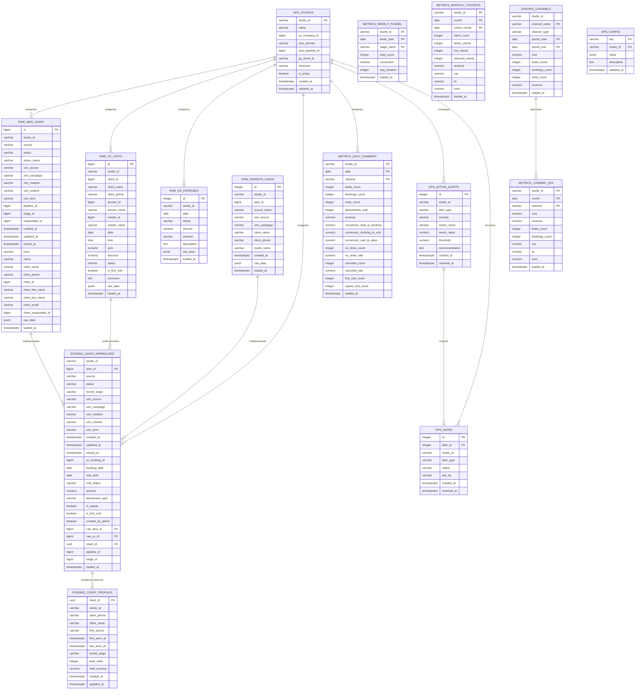

# ER Диаграмма базы данных massage_studio

## Схема базы данных (PostgreSQL)



## Описание схем

### 1. raw — Сырые данные из источников

| Таблица | Источник | Описание |
|---------|----------|----------|
| `amo_leads` | AMO CRM | Лиды из CRM с полной инфой о клиенте |
| `yc_visits` | YClients | Записи на приём (визиты) |
| `gs_expenses` | Google Sheets | Расходы по статьям и каналам |
| `gsheets_leads` | Google Sheets | Лиды из рекламных каналов |

**Ключевые поля для матчинга:**
- `client_phone` — нормализованный телефон
- `studio_id` — идентификатор студии

### 2. staging — Нормализованные данные

| Таблица | Описание |
|---------|----------|
| `leads_normalized` | Единый формат лидов из всех источников |
| `client_profiles` | Профили клиентов с агрегированными метриками |
| `channels` | Нормализованные данные по каналам |

**Матчинг:**
- `raw_amo_id` → `raw.amo_leads.id`
- `raw_yc_id` → `raw.yc_visits.id`
- `client_id` → `staging.client_profiles.client_id`

### 3. metrics — Агрегированные метрики

| Таблица | Гранулярность | Метрики |
|---------|---------------|---------|
| `daily_summary` | День × Канал | Конверсии, no-show, выручка |
| `weekly_funnel` | Неделя × Этап | Воронка, время прохождения |
| `monthly_cohorts` | Месяц × Когорта | CAC, LTV, ROMI |
| `channel_roi` | Месяц × Канал | ROI по каналам |

### 4. ops — Операционные данные

| Таблица | Назначение |
|---------|------------|
| `studios` | Справочник студий с настройками интеграций |
| `active_alerts` | Активные алерты (A01-A04) |
| `gates` | HITL-gates для блокировки pipeline |
| `config` | Конфигурация и настройки |

**Внешние ключи:**
- `ops.gates.alert_id` → `ops.active_alerts.id`

## Поток данных (Pipeline S1→S5)

```
S1: Collect
  ├── AMO API → raw.amo_leads
  ├── YClients API → raw.yc_visits
  ├── Google Sheets → raw.gs_expenses
  └── Google Sheets → raw.gsheets_leads

S2: Normalize
  └── raw.* → staging.leads_normalized
      └── + staging.client_profiles

S3: Reconcile
  └── staging ↔ raw (проверка согласованности)
      └── ops.active_alerts (при расхождениях)

S4: Metrics
  └── staging → metrics.*

S5a: Alerts
  └── metrics → ops.active_alerts (A01-A04)
      └── ops.gates (при критических)

S5b: Reports
  └── metrics → Telegram-отчёты
```

## Индексы для производительности

```sql
-- raw слой (поиск по телефону и дате)
CREATE INDEX idx_amo_leads_phone ON raw.amo_leads(client_phone);
CREATE INDEX idx_amo_leads_created ON raw.amo_leads(created_at);
CREATE INDEX idx_yc_visits_phone ON raw.yc_visits(client_phone);
CREATE INDEX idx_yc_visits_date ON raw.yc_visits(date);

-- staging (матчинг)
CREATE INDEX idx_leads_norm_phone ON staging.leads_normalized(utm_source, created_at);
CREATE INDEX idx_client_profiles_phone ON staging.client_profiles(client_phone);

-- metrics (отчёты)
CREATE INDEX idx_daily_summary_date ON metrics.daily_summary(date, studio_id);
CREATE INDEX idx_channel_roi_month ON metrics.channel_roi(month, studio_id);
```
