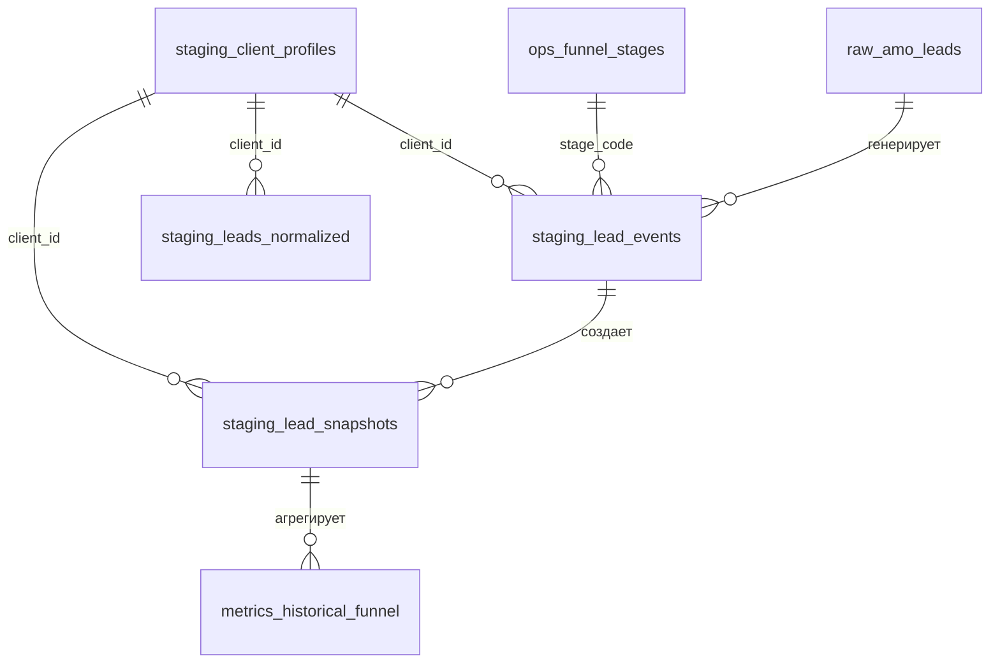

# Event-Based Architecture Documentation

## Обзор

Переход от snapshot-based к event-based архитектуре для массажной студии.

### Snapshot vs Event-Based

| Snapshot-Based | Event-Based |
|----------------|-------------|
| Хранит только текущее состояние | Хранит каждое изменение как событие |
| Нельзя посмотреть историю | Можно восстановить состояние на любую дату |
| Перезаписывает данные | Неизменяемые (immutable) события |
| Простые запросы | Требует агрегации |

## Новые таблицы

### `staging.lead_events` — ядро event-based

Каждое изменение лида = отдельная строка. Связь с клиентом через `client_id`.

```sql
SELECT * FROM staging.lead_events
WHERE lead_id = 12345 AND source = 'amo'
ORDER BY event_timestamp;

-- Все события клиента (сквозная аналитика)
SELECT * FROM staging.lead_events
WHERE client_id = 'uuid-...'
ORDER BY event_timestamp;
```

| Поле | Описание |
|------|----------|
| `event_id` | UUID v4, PK |
| `lead_id` | ID из источника (AMO, YClients) |
| `client_id` | UUID клиента (FK → client_profiles) |
| `event_type` | created / status_changed / merged / deleted |
| `stage_from` | Предыдущий статус (NULL для created) |
| `stage_to` | Новый статус |
| `event_timestamp` | Когда произошло в источнике |

### `staging.lead_snapshots` — версионированные состояния

SCD Type 2: каждая строка представляет состояние на интервал `[valid_from, valid_to)`. Содержит `client_id` для сквозного анализа.

```sql
-- Состояние лида на конкретную дату
SELECT * FROM staging.lead_snapshots
WHERE lead_id = 12345
  AND valid_from <= '2026-03-01'
  AND (valid_to IS NULL OR valid_to > '2026-03-01');

-- Все состояния клиента по всем лидам
SELECT * FROM staging.lead_snapshots
WHERE client_id = 'uuid-...'
ORDER BY valid_from;
```

## Event-Based метрики

### `metrics.funnel_transitions`

Анализирует переходы между статусами.

```sql
-- Сколько лидов перешло из новых в переговоры за март
SELECT lead_count, avg_duration_hours
FROM metrics.funnel_transitions
WHERE transition_date BETWEEN '2026-03-01' AND '2026-03-31'
  AND stage_from = 'new'
  AND stage_to = 'negotiation';
```

### `metrics.lead_stage_durations`

Статистика времени на этапах (avg, median, p95).

```sql
-- Среднее и медианное время на этапе "переговоры"
SELECT week_start, avg_duration_hours, median_duration_hours
FROM metrics.lead_stage_durations
WHERE stage_name = 'negotiation'
ORDER BY week_start DESC;
```

### `metrics.historical_funnel`

Срез воронки на любую дату в прошлом.

```sql
-- Сколько лидов было в переговорах 1 марта 2026
SELECT lead_count FROM metrics.historical_funnel
WHERE snapshot_date = '2026-03-01' AND stage_name = 'negotiation';
```

## Pipeline шаги

### S2c: Process Events

Генерация событий из raw-данных.

```bash
# Запуск
python -m pipeline.run_pipeline s2c --studio studio_a
```

**Что делает:**
1. Создает события `created` для новых лидов
2. Создает события `status_changed` при изменении статуса
3. Создает snapshots (SCD Type 2)

### S4b: Event-Based Metrics

Расчет метрик из событий.

```bash
# Запуск
python -m pipeline.run_pipeline s4b --studio studio_a
```

**Что делает:**
1. Считает `funnel_transitions`
2. Считает `lead_stage_durations`
3. Считает `historical_funnel`

## Client ID — сквозная аналитика

Все event-based таблицы содержат `client_id` для связи событий с клиентом:

| Таблица | client_id | Назначение |
|---------|-----------|------------|
| `staging.lead_events` | ✓ | Связь событий с клиентом |
| `staging.lead_snapshots` | ✓ | Сквозная история по клиенту |
| `staging.leads_normalized` | ✓ | Быстрый доступ к client_id |
| `staging.client_profiles` | PK | Единый профиль клиента |

### Разрешение client_id

При обработке событий `s2c_process_events.sql`:

```sql
-- 1. Ищем существующий client_id по телефону
SELECT client_id FROM staging.client_profiles 
WHERE client_phone = '79161234567';

-- 2. Если не найден — создаем новый профиль
INSERT INTO staging.client_profiles (client_phone, first_seen_at)
VALUES ('79161234567', NOW())
RETURNING client_id;

-- 3. Записываем событие с client_id
INSERT INTO staging.lead_events (client_id, ...)
VALUES (resolved_client_id, ...);
```

### Сквозная воронка по клиенту

```sql
-- Все события клиента из всех источников
SELECT 
    e.event_timestamp,
    e.source,
    e.event_type,
    e.stage_from,
    e.stage_to,
    cp.client_name
FROM staging.lead_events e
JOIN staging.client_profiles cp ON cp.client_id = e.client_id
WHERE e.client_id = 'uuid-client-id'
ORDER BY e.event_timestamp;
```

## Примеры запросов

### Историческая воронка

```sql
-- Воронка на 1 марта 2026
SELECT stage_name, lead_count
FROM metrics.historical_funnel
WHERE snapshot_date = '2026-03-01'
ORDER BY lead_count DESC;
```

### Конверсия между этапами

```sql
-- Переходы new → negotiation → visit
WITH transitions AS (
    SELECT * FROM metrics.funnel_transitions
    WHERE transition_date >= '2026-03-01'
)
SELECT
    (SELECT SUM(lead_count) FROM transitions WHERE stage_from = 'new') AS new_leads,
    (SELECT SUM(lead_count) FROM transitions WHERE stage_to = 'negotiation') AS to_negotiation,
    (SELECT SUM(lead_count) FROM transitions WHERE stage_to = 'visited') AS to_visit;
```

### Бутылочные горлышки

```sql
-- Где лиды задерживаются больше всего?
SELECT stage_name, avg_duration_hours, median_duration_hours
FROM metrics.lead_stage_durations
WHERE week_start = '2026-03-01'
ORDER BY median_duration_hours DESC;
```

## Миграция

### Phase 1: Создание таблиц ✓

```sql
-- migrations/010_event_schema.sql
-- migrations/011_add_client_id_to_events.sql
-- migrations/012_funnel_stages.sql
-- Созданы: staging.lead_events, staging.lead_snapshots (с client_id)
--          ops.funnel_stages — справочник этапов воронки
--          metrics.funnel_transitions, metrics.lead_stage_durations, metrics.historical_funnel
```

### Phase 2: Pipeline шаги ✓

```sql
-- pipeline/s2c_process_events.sql (с client_id + stage mapping)
-- pipeline/s4b_event_metrics.sql
-- Features:
--   - автоматическое создание client_profiles при обработке событий
--   - маппинг AMO stage_id → ops.funnel_stages.stage_code
--   - нормализация статусов YClients через funnel_stages
```

### Phase 3: Backfill (следующий шаг)

Заполнить исторические события из существующих raw-данных:

```bash
# Backfill за последние 6 месяцев
python -m pipeline.run_pipeline s2c --studio studio_a --since "2025-11-01"
python -m pipeline.run_pipeline s4b --studio studio_a --since "2025-11-01"
```

### Phase 4: Hybrid Mode

Оба подхода работают параллельно:
- S2/S4: snapshot-based (текущий)
- S2c/S4b: event-based (новый)

### Phase 5: Переход на Event-Based

Переключение отчетов на event-based метрики.

### Phase 6: Cleanup

Удаление snapshot-only таблиц (после полного перехода).

## Справочник этапов воронки (ops.funnel_stages)

Единый справочник этапов с порядком следования и категориями.

### Структура

| Поле | Описание |
|------|----------|
| `stage_code` | Уникальный код (new, negotiation, visited...) |
| `stage_name` | Человекочитаемое название |
| `stage_order` | Порядок в воронке (0, 1, 2...) |
| `stage_group` | Категория: new / active / closed_won / closed_lost / paused |
| `amo_stage_id` | Сопоставление с ID статуса в AMO CRM |

### Предустановленные этапы

| Код | Название | Группа | Порядок |
|-----|----------|--------|---------|
| `new` | Новый лид | new | 0 |
| `contacted` | Контакт установлен | active | 1 |
| `negotiation` | Переговоры | active | 2 |
| `booking_made` | Запись создана | active | 3 |
| `visited` | Визит состоялся | closed_won | 4 |
| `abonement_sold` | Абонемент продан | closed_won | 5 |
| `no_show` | Неявка | closed_lost | 99 |
| `canceled` | Отмена | closed_lost | 99 |
| `lost` | Потерян | closed_lost | 99 |

### Использование в запросах

```sql
-- Воронка с правильным порядком этапов
SELECT
    fs.stage_name,
    COUNT(*) AS lead_count
FROM staging.lead_snapshots s
JOIN ops.funnel_stages fs ON fs.stage_code = s.stage_name
WHERE s.studio_id = 'studio_a'
  AND s.valid_to IS NULL  -- текущее состояние
GROUP BY fs.stage_order, fs.stage_name
ORDER BY fs.stage_order;

-- Конверсия по группам (active → closed_won)
SELECT
    prev.stage_group AS from_group,
    curr.stage_group AS to_group,
    COUNT(*) AS transitions
FROM staging.lead_events e
JOIN ops.funnel_stages prev ON prev.stage_code = e.stage_from
JOIN ops.funnel_stages curr ON curr.stage_code = e.stage_to
WHERE e.event_type = 'status_changed'
GROUP BY prev.stage_group, curr.stage_group;
```

## ER Diagram

См. `docs/er-diagram-event-based.mmd`



**Ключевые связи:**
- `staging.lead_events.client_id` → `staging.client_profiles.client_id`
- `staging.lead_snapshots.client_id` → `staging.client_profiles.client_id`
- `staging.lead_events.stage_to` → `ops.funnel_stages.stage_code`
